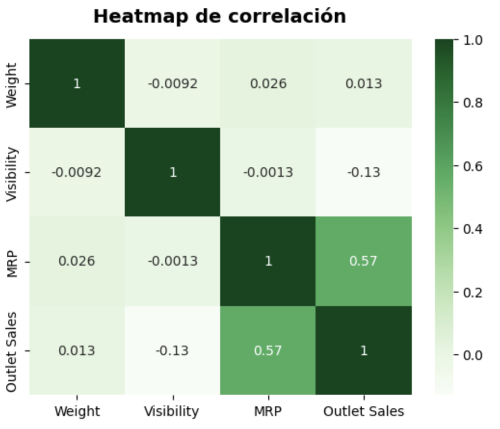

# Sales Predictions

## Project Objective

The objective of this project is to develop a predictive model to estimate sales (Item_Outlet_Sales) of products in different outlets, using specific product and outlet characteristics.

## Dataset Description
The dataset includes information on products and outlets. The available columns are:

- **Item_Identifier**:  Unique identifier of the product.
- **Item_Weight**: Product weight
- **Item_Fat_Content**: Fat content of the product (e.g., Low Fat and Regular)
- **Item_Visibility**: Percentage of product visibility at the point of sale
- **Item_Type**: Product category (e.g., dairy, soft drinks)
- **Item_MRP**: Maximum retail price of the product
- **Outlet_Identifier**: Unique identifier of the point of sale
- **Outlet_Establishment_Year**: Year of outlet establishment
- **Outlet_Size**: Outlet size (e.g., small, medium, high)
- **Outlet_Location_Type**: Type of location of the outlet (e.g., tier1, tier2, tier3)
- **Outlet_Type**: Type of outlet (e.g., supermarket, grocery store)
- **Item_Outlet_Sales**: Sales of the product at the point of sale (target variable)

## Exploratory Data Analysis (EDA)
To better understand the data, we conducted an exploratory data analysis. Below are some key graphs:

### Relationship between Sales of Product and Outlet Size

### Relationship between MRP and Sales of Product

## Methodology
1. Data Exploration:
- Exploratory data analysis (EDA) to understand the distribution and relationships between variables.
- Treatment of null values and outliers.

2. Preparation:
- Coding of categorical variables.
- Scaling of numerical variables.

3. Model training:
- Division of the data into training and test sets.
- Training of a linear regression model.
- Evaluation of model performance using metrics such as coefficient of determination (R²) and root mean square error (RMSE).
  
4. Model Validation and Fitting:
- Cross-validation to ensure model robustness.
- Hyperparameter tuning and decision tree model selection to improve accuracy.
  
## Results
R² of Training Model: 0.604
R² of the Test Model: 0.595
RMSE of Training Model: 1082.65
RMSE of Test Model: 1057.44
These results indicate that the model can reasonably predict sales with an error representing approximately 8.1% of the total sales range.

## Conclusions
The regression tree model can predict point-of-sale product sales with a good degree of accuracy, considering the intrinsic variability of the data. Since with this, a better performance metric is obtained in the test data being 2.77% higher than the performance metric of the regression model. It is also worth noting that the variance in this model is minimal, which means that the model performs well with the data with training and test data. It is recommended that more complex models and additional optimization techniques be explored to reduce error further and improve prediction accuracy.
